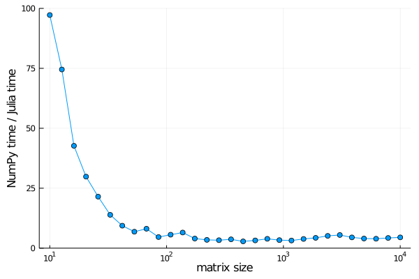
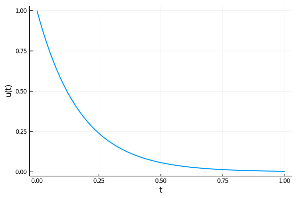

# Julia learning notes
Some notes from my first day of learning the Julia language; converted from an iPython notebook I wrote based heavily on work by [crstnbr](https://github.com/crstnbr/JuliaOulu20).

<!--BEGIN TOC-->
## Table of Contents
1. [Types and Dispatch](#types-and-dispatch)
2. [Functions and Dispatch](#functions-and-dispatch)
    1. [Parametric types](#parametric-types)
    2. [Union types and the `where` keyword](#union-types-and-the-where-keyword)
    3. [Posterity: variadics](#posterity:-variadics)
3. [Custom Types](#custom-types)
    1. [Defining a data type](#defining-a-data-type)
    2. [Abstract Interfaces](#abstract-interfaces)
4. [Benchmarking](#benchmarking)
5. [Specializations and speed](#specializations-and-speed)
    1. [Julia compile-to-run graph](#julia-compile-to-run-graph)
    2. [Specialization and code inspection](#specialization-and-code-inspection)
    3. [Estimating the performance gain of specialization](#estimating-the-performance-gain-of-specialization)
    4. [Using Run-time effectively](#using-run-time-effectively)
6. [Generic programming](#generic-programming)
    1. [Generic Programming with Multiple Dispatch and JIT](#generic-programming-with-multiple-dispatch-and-jit)
    2. [Example: DifferentialEquations.jl](#example:-differentialequations-jl)
7. [*Gotchas* and how to handle them](#*gotchas*-and-how-to-handle-them)
    1. [Gotcha 1: Global scope](#gotcha-1:-global-scope)
        1. [Solution 1: Wrap code in functions](#solution-1:-wrap-code-in-functions)
        2. [Solution 2: Declare globals as (compile-time) constants](#solution-2:-declare-globals-as-(compile-time)-constants)
    2. [Gotcha 2: Type-instabilities](#gotcha-2:-type-instabilities)
        1. [Solution 1: Avoid type changes](#solution-1:-avoid-type-changes)
        2. [Solution 2: Detect issues with `@code_warntype` or `@trace`](#solution-2:-detect-issues-with-@code_warntype-or-@trace)
        3. [Solution 3: C/Fortran type specifications](#solution-3:-c/fortran-type-specifications)
        4. [Solution 4: Function barriers](#solution-4:-function-barriers)
    3. [Gotcha 3: Views and copies](#gotcha-3:-views-and-copies)
8. [Examples](#examples)
    1. [Gotcha 4: Temporary allocations and vectorized code](#gotcha-4:-temporary-allocations-and-vectorized-code)
        1. [Solution: More dots and explicit code](#solution:-more-dots-and-explicit-code)
    2. [Gotcha 5: Abstract fields](#gotcha-5:-abstract-fields)
    3. [Gotcha 6: Writing to global scope](#gotcha-6:-writing-to-global-scope)
    4. [Gotcha 7: Column major order](#gotcha-7:-column-major-order)
        1. [**NB**: put the fastest varying index first!](#**nb**:-put-the-fastest-varying-index-first!)
    5. [Gotcha 8: Lazy operations](#gotcha-8:-lazy-operations)
9. [Examples](#examples)
    1. [Extra: Generators and comprehension.](#extra:-generators-and-comprehension-)

<!--END TOC-->

## Types and Dispatch
Julia has notions of **concrete** and **abstract** types; i.e. those of objects, and those that cannot be instantiated but instead define a structure.


```julia
@show typeof(3) typeof(3.0) isconcretetype(Float64) isabstracttype(Number) isabstracttype(Real)

println("\nInvestigating the type tree:")
@show supertype(Float64) subtypes(AbstractFloat);

```

    typeof(3) = Int64
    typeof(3.0) = Float64
    isconcretetype(Float64) = true
    isabstracttype(Number) = true
    isabstracttype(Real) = true
    
    Investigating the type tree:
    supertype(Float64) = AbstractFloat
    subtypes(AbstractFloat) = Any[BigFloat, Float16, Float32, Float64]


Everything is a subtype of `Any`, just as in Python with `Object`. We can investigate this for `Type` with the `<:` operator, and for objects, with the `isa` keyword:


```julia
@show Number <: Any
@show 3.0 isa Float64 3.0 isa Int32;
```

    Number <: Any = true
    3.0 isa Float64 = true
    3.0 isa Int32 = false


```julia
function show_supertypes(T)
    """ function for investigating type tree from leaf T to root Any """
    print(T)
    while T != Any
        T = supertype(T)
        print(" <: ", T, "\n")
    end
end

show_supertypes(Float64)
show_supertypes(String);
```

    Float64 <: AbstractFloat
     <: Real
     <: Number
     <: Any
    String <: AbstractString
     <: Any


Tool for facilitating creating easy print trees is `AbstractTrees`, which we can define a method for to tailor our case to print subtypes.


```julia
import Pkg; Pkg.add("AbstractTrees");
using AbstractTrees
```

       Updating registry at `~/.julia/registries/General`


    [?25l

       Updating git-repo `https://github.com/JuliaRegistries/General.git`


    [?25h

      Resolving package versions...
       Updating `~/.julia/environments/v1.4/Project.toml`
     [no changes]
       Updating `~/.julia/environments/v1.4/Manifest.toml`
     [no changes]


```julia
AbstractTrees.children(x::Type) = subtypes(x)
print_tree(Number)
```

    Number
    ├─ Complex
    └─ Real
       ├─ AbstractFloat
       │  ├─ BigFloat
       │  ├─ Float16
       │  ├─ Float32
       │  └─ Float64
       ├─ AbstractIrrational
       │  └─ Irrational
       ├─ Integer
       │  ├─ Bool
       │  ├─ Signed
       │  │  ├─ BigInt
       │  │  ├─ Int128
       │  │  ├─ Int16
       │  │  ├─ Int32
       │  │  ├─ Int64
       │  │  └─ Int8
       │  └─ Unsigned
       │     ├─ UInt128
       │     ├─ UInt16
       │     ├─ UInt32
       │     ├─ UInt64
       │     └─ UInt8
       └─ Rational


Note that only **concrete** types are and leaf points, whereas **abstract** types are the nodes.

## Functions and Dispatch
Example: a function that calculates absolute values (like builtin `abs` already does).
Want something to work for Reals and Complex; thus want to create type specific implementations of the function:


```julia
myabs(x::Real) = sign(x) * x
myabs(z::Complex) = sqrt(real(z * conj(z)))
@show myabs(-4.32) myabs(1.0+1.0im);

println("\n", methods(myabs))
# check which method is being used using the @which macro
println(@which myabs(-4.32))
println(@which myabs(1.0 + 1.0im));
```

    myabs(-4.32) = 4.32
    myabs(1.0 + 1.0im) = 1.4142135623730951
    
    # 2 methods for generic function "myabs":
    [1] myabs(x::Real) in Main at In[6]:1
    [2] myabs(z::Complex) in Main at In[6]:2
    myabs(x::Real) in Main at In[6]:1
    myabs(z::Complex) in Main at In[6]:2


Multiple dispatch in Julia optimises to pick the most **specific method** for given input parameter types. We can also modify the standard functions for our flavour or needs:


```julia
import Base: + # have to import functions to be able to override/extend them
+(x::String, y::String) = x * " " * y

# now, any use of +, even in functions, uses our method
println("Hello" + "World")
println(sum(["Hello", "World"]));

# no unique most specific method
testf(x::Int, y::Any) = println("int")
testf(x::Any, y::String) = println("string")
testf(3, "test")
```

    Hello World
    Hello World


    MethodError: testf(::Int64, ::String) is ambiguous. Candidates:
      testf(x::Int64, y) in Main at In[7]:9
      testf(x, y::String) in Main at In[7]:10
    Possible fix, define
      testf(::Int64, ::String)

    

    Stacktrace:

     [1] top-level scope at In[7]:11


### Parametric types
An example of use of **type parameters** is the Julia array type:


```julia
M = rand(2, 2)
@show M typeof(M);
```

    M = [0.9615517851600281 0.2903357436474676; 0.19803186892630564 0.52189913680374]
    typeof(M) = Array{Float64,2}


`Array` is a parametric array, with type `Float64`and dimension `2`. Thus, `M` is a 2x2 matrix. We can also create the same for `String` type arrays, or nest parametric types:


```julia
M = fill("Hello World", 2, 2)
@show M typeof(M) eltype(M);

# using list comprehension to create a vector of matrices of floats
v = [rand(2,2) for i in 1:3]
println()
@show v eltype(v);

# Julia has aliases for matrix and vectors
println()
println(Matrix{Float64} === Array{Float64, 2})
println(Vector{Float64} == Array{Float64, 1})
```

    M = ["Hello World" "Hello World"; "Hello World" "Hello World"]
    typeof(M) = Array{String,2}
    eltype(M) = String
    
    v = [[0.09276764692539108 0.03911682059083299; 0.3521196560922837 0.3858365720172432], [0.08326363372635615 0.10287492655839703; 0.6998072334761969 0.9958601605012154], [0.21398961354127977 0.432695279314101; 0.17643405797687572 0.391593928329907]]
    eltype(v) = Array{Float64,2}
    
    true
    true


### Union types and the `where` keyword
Note that `Vector{Float64} <: Vector{Real}` is `false`, despite `Float64 <: Real`, and this is exactly since `Vector{Real}` is a concrete type (with elements `T <: Real`): **concrete types** don't have subtypes.


```julia
@show Real[1, 2.2, 13f0]
@show isconcretetype(Vector{Real})
# what we actually mean is
@show Vector{Float64} <: Vector{T} where T <: Real
# thus, written explicitly
@show Vector{Real} <: Vector{T where T <: Real};
```

    Real[1, 2.2, 13.0f0] = Real[1, 2.2, 13.0f0]
    isconcretetype(Vector{Real}) = true
    Vector{Float64} <: (Vector{T} where T <: Real) = true
    Vector{Real} <: Vector{T where T <: Real} = true


```julia
# type parameters as function signatures
h(x::Integer) = typeof(x)
h(x::T) where T = T
h(x::Matrix{T}) where T <: Real = "i will be overwritten by the next def"
# or
h(x::Matrix{<:Real}) = eltype(x)
@show h(rand(Float32,2,2))

d(x::T, y::T) where T = "same type"
d(x, y) = "different types"
@show d(3, 4) d(3.0, 1);
```

    h(rand(Float32, 2, 2)) = Float32
    d(3, 4) = "same type"
    d(3.0, 1) = "different types"


```julia
# duck typing example
x = 1:30
@show x typeof(x) typeof(x) <: AbstractArray;
println()
# since it is <:AbstractArray, can perform array actions
@show x[3] size(x) eltype(x);
# but it isn't an actual Array, which can be seen by examining the fields
@show fieldnames(typeof(x))
# or inspecting source code
@which UnitRange(1, 30)
```

    x = 1:30
    typeof(x) = UnitRange{Int64}
    typeof(x) <: AbstractArray = true
    
    x[3] = 3
    size(x) = (30,)
    eltype(x) = Int64
    fieldnames(typeof(x)) = (:start, :stop)


(::<b>Type{UnitRange}</b>)(start::<b>T</b>, stop::<b>T</b>)<i> where T<:Real</i> in Base at <a href="https://github.com/JuliaLang/julia/tree/381693d3dfc9b7072707f6d544f82f6637fc5e7c/base/range.jl#L279" target="_blank">range.jl:279</a>


When performing an indexing, a small function is executed (see with `@which getindex(x, 4)` for example); can be used in calculations without having to allocate memory for a full array. Memory allocation is expensive:


```julia
@time collect(1:1000000);
@time 1:1000000;

```

      0.021088 seconds (2 allocations: 7.629 MiB, 81.03% gc time)
      0.000000 seconds


Other types include union types `Union{Float64, Int32}`, [bit based](https://docs.julialang.org/en/v1/manual/calling-c-and-fortran-code/#man-bits-types-1) typing and check functions, e.g. `isbits(x)`, `isbitstype(T)`

Full refernce for types can be found in [this page of the manual](https://docs.julialang.org/en/latest/manual/types/).

### Posterity: variadics
Julia can use variadic arguments in function signatures or calls:


```julia
f(x...) = println(x)
f(3, 1.2, "Hello");
g(x::Vector) = +(x...)
g([1,2,3])
```

    (3, 1.2, "Hello")


    6


The use of the `...` operator can be a little misleading, but is [well documented](https://docs.julialang.org/en/v1/manual/faq/index.html#What-does-the-...-operator-do?-1).

It can either
- combine many arguments into one argument, like `*args` in Python. Returns type `Tuple`
- split one argument into many different arguments in a function call, like calling a function with `f(*some_list)` in Python.

## Custom Types
### Defining a data type
Types can be defined with the `struct` keyword (*NB*: they cannot be redefined; would have to restart the Julia kernel). The `struct` objects behave like classes, with different methods (e.g. constructors) defineable. They are by default **immutable**, but note that the immutability does not propagate (**edit**: it totally does?):


```julia
struct ImmPropagate
    x::Vector{Int64}
end
t = ImmPropagate([1, 2, 3])
@show t.x
try t.x = [3, 4, 5] catch x; println(x) end
t.x[1] = 0
@show t.x
t.x .= [3, 8, 12] # dot performs el-wise assignment
@show t.x;
```

    t.x = [1, 2, 3]
    ErrorException("setfield! immutable struct of type ImmPropagate cannot be changed")
    t.x = [0, 2, 3]
    t.x = [3, 8, 12]


```julia
# define abstract types and subtype them easily
abstract type SomeAbstractType end

struct SomeConcreteType <: SomeAbstractType
    somefield::String
end
supertype(SomeConcreteType)
```


    SomeAbstractType


```julia
# example: a diagonal matrix structure
import Base: +, -, *, /

struct DiagonalMat
    diag::Vector{Float64}
    # functions declared here are private?
end
+(a::DiagonalMat, b::DiagonalMat) = DiagonalMat(a.diag + b.diag)
-(a::DiagonalMat, b::DiagonalMat) = DiagonalMat(a.diag - b.diag)

d1 = DiagonalMat([1, 2, 3]) # implicit conversion to float
d2 = DiagonalMat([2.4, 1.9, 5])
@show d1+d2 d1-d2
```

    d1 + d2 = DiagonalMat([3.4, 3.9, 8.0])
    d1 - d2 = DiagonalMat([-1.4, 0.10000000000000009, -2.0])


    DiagonalMat([-1.4, 0.10000000000000009, -2.0])


### Abstract Interfaces
Integrating an object into Julia's type hierarchy is as simple as subtyping an abstract class, and implementing its interface. For example, we could recreate the `DiagonalMat` struct by subtyping `AbstractMatrix`, and the storage with `AbstractVector`:


```julia
struct DiagonalMatrix{T, V <: AbstractVector{T}} <: AbstractMatrix{T}
    diag::V
end

# implement AbstractArray interface
Base.size(D::DiagonalMatrix) = (length(D.diag), length(D.diag))
    
function Base.getindex(D::DiagonalMatrix{T,V}, i::Int, j::Int) where {T, V}
    if i == j
        r = D.diag[i]
    else
        r = zero(T)
    end
    r
end

# different syntactic sugar, same idiom
function setindex!(D::DiagonalMatrix, v, i::Int, j::Int)
    if i == j
        D.diag[i] = v
    else
        throw(ArgumentError("cannot set off-diagonal entry ($i, $j)"))
    end
    return v
end
    
```


    setindex! (generic function with 1 method)


```julia
D = DiagonalMatrix([1, 2, 3])
# automatically has +, -, *, etc. defined, and pprint
@show D D*D D+D
```

    D = [1 0 0; 0 2 0; 0 0 3]
    D * D = [1 0 0; 0 4 0; 0 0 9]
    D + D = [2 0 0; 0 4 0; 0 0 6]


    3×3 Array{Int64,2}:
     2  0  0
     0  4  0
     0  0  6


```julia
# even more complicated functions
println(sin.(D))
println(sum([D, D, D]))
using LinearAlgebra
eigen(D)
```

    [0.8414709848078965 0.0 0.0; 0.0 0.9092974268256817 0.0; 0.0 0.0 0.1411200080598672]
    [3 0 0; 0 6 0; 0 0 9]


    Eigen{Float64,Float64,Array{Float64,2},Array{Float64,1}}
    values:
    3-element Array{Float64,1}:
     1.0
     2.0
     3.0
    vectors:
    3×3 Array{Float64,2}:
     1.0  0.0  0.0
     0.0  1.0  0.0
     0.0  0.0  1.0


```julia
@which D+D
```


+(A::<b>AbstractArray</b>, B::<b>AbstractArray</b>) in Base at <a href="https://github.com/JuliaLang/julia/tree/381693d3dfc9b7072707f6d544f82f6637fc5e7c/base/arraymath.jl#L38" target="_blank">arraymath.jl:38</a>


Can be advantageous to define fast implementations


```julia
+(Da::DiagonalMatrix, Db::DiagonalMatrix) = DiagonalMatrix(Da.diag + Db.diag)
-(Da::DiagonalMatrix, Db::DiagonalMatrix) = DiagonalMatrix(Da.diag - Db.diag)

@which D+D
```


+(Da::<b>DiagonalMatrix</b>, Db::<b>DiagonalMatrix</b>) in Main at In[11]:1


## Benchmarking
Benchmarking in Julia is easily fascilitated with the [`BenchmarkTools.jl` library](https://github.com/JuliaCI/BenchmarkTools.jl/blob/master/doc/manual.md):


```julia
import Pkg; Pkg.add("BenchmarkTools")
using BenchmarkTools
```


```julia
operation(x) = x + 2 * x
x = rand(2, 2)
@time operation.(x)
```

      0.039672 seconds (119.02 k allocations: 5.585 MiB)


    2×2 Array{Float64,2}:
     0.600999  2.49352
     0.280951  2.15671


```julia
function f()
    x = rand(2, 2)
    @time operation.(x)
end
f()
```

      0.000000 seconds (1 allocation: 112 bytes)


    2×2 Array{Float64,2}:
     2.31605  2.80158
     1.1832   0.2232


Presumably (ref?) should wrap benchmarking operations in functions to ensure we make good use of stack framing, instead of relying on the JIT in the REPL. The `@benchmark` macro provides this behaviour, with additional statistics, and if that is not needed, `@btime` is a better replacement for `@time`:


```julia
println(@benchmark operation.(x))
```

    Trial(265.835 ns)


```julia
@btime operation.(x);
@btime operation.($x); # interpolate value of x into expression to avoid overhead of globals
```

      254.460 ns (7 allocations: 272 bytes)


Aside: for more on interpolation, see [documentation here](https://docs.julialang.org/en/v1/manual/metaprogramming/#man-expression-interpolation-1). It can be thought of, in the above example, as writing explicitly the contents of x in `[]` notation.


```julia
x = rand(100)
Djl = Diagonal(x)
D = DiagonalMatrix(x)
@btime operation(Djl);
@btime operation(D);
```

      150.364 ns (3 allocations: 1.77 KiB)
      19.566 μs (4 allocations: 156.41 KiB)


## Specializations and speed
Julia *can* be one of the fastest conventional languages (rivaling or nearly outperforming C in certain circumstances). To explore this, let's use the example case of a [Vandermonde matrix](https://en.wikipedia.org/wiki/Vandermonde_matrix). We'll begin with comparisons to the Python implementation, and the numpy C-backended library:


```julia
ENV["PYTHON"] = replace(read(`which python`, String), "\n" => "")
import Pkg; Pkg.add("PyCall"); Pkg.build("PyCall")
using PyCall
```

      Resolving package versions...
       Updating `~/.julia/environments/v1.4/Project.toml`
     [no changes]
       Updating `~/.julia/environments/v1.4/Manifest.toml`
     [no changes]
       Building Conda ─→ `~/.julia/packages/Conda/3rPhK/deps/build.log`
       Building PyCall → `~/.julia/packages/PyCall/zqDXB/deps/build.log`
    ┌ Info: Precompiling PyCall [438e738f-606a-5dbb-bf0a-cddfbfd45ab0]
    └ @ Base loading.jl:1260
    WARNING: using PyCall.setindex! in module Main conflicts with an existing identifier.


```julia
np = pyimport("numpy")
np.vander(1:5, increasing=true)
```


    5×5 Array{Int64,2}:
     1  1   1    1    1
     1  2   4    8   16
     1  3   9   27   81
     1  4  16   64  256
     1  5  25  125  625


```julia
# julia implementation
function vander(x::AbstractVector{T}, n=length(x)) where T
    m = length(x)
    V = Matrix{T}(undef, m, n)
    for j = 1:m
        V[j,1] = one(x[j])
    end
    for i = 2:n
        for j = 1:m
            V[j, i] = x[j] * V[j, i-1]
        end
    end
    return V
end
vander(1:5)
```


    5×5 Array{Int64,2}:
     1  1   1    1    1
     1  2   4    8   16
     1  3   9   27   81
     1  4  16   64  256
     1  5  25  125  625


```julia
using BenchmarkTools, Plots
ns = exp10.(range(1, 4, length=30));

tnp = Float64[]
tjl = Float64[]
for n in ns
    x = 1:n |> collect
    push!(tnp, @belapsed np.vander($x) samples=3 evals=1)
    push!(tjl, @belapsed vander($x) samples=3 evals=1)
end
plot(ns, tnp./tjl, m=:circle, xscale=:log10, xlab="matrix size", ylab="NumPy time / Julia time", legend=:false)
```





The Julia implementation also works for non-numerical types, as long as a `one` identity is defined, aswell as the multiplication operator.

### Julia compile-to-run graph


**AST** = Abstract Syntax Tree

**SSA** = Static Single Assignment 

**LLVM** = Low Level Virtual Machine

### Specialization and code inspection
Julia specializes on the function argument types. When a function is **called** for the first time, Julia pre-compiles machine code for the given input types. For **subsequent calls**, the machine code can be reused, until a function with different input types is called. It can therefore be argued that it is benefitial to write specialized functions from the get-go, to limit the need for pre-compilation.


```julia
func(x, y) = x^2 + y
@time func(1, 2) # compilation + execution
@time func(1, 2) # just execution
@time func(1.3, 4.8); # compilation for float + execution
```

      0.000000 seconds
      0.000000 seconds
      0.000000 seconds


    6.49


To examine this further, we can inspect the code transformation stages with builtin macros:
- AST after parsing (`@macroexpand`)
- AST after lowering (`@code_typed`, `@code_warntype`)
- AST after inference and optimization (`@code_lowered`)
- LLVM IR (`@code_llvm`)
- assembly machine code (`@code_native`)


```julia
@code_typed func(1, 2)
```


    CodeInfo(
    1 ─ %1 = Base.mul_int(x, x)::Int64
    │   %2 = Base.add_int(%1, y)::Int64
    └──      return %2
    ) => Int64


```julia
@code_lowered func(1, 2)
```


    CodeInfo(
    1 ─ %1 = Core.apply_type(Base.Val, 2)
    │   %2 = (%1)()
    │   %3 = Base.literal_pow(Main.:^, x, %2)
    │   %4 = %3 + y
    └──      return %4
    )


```julia
@code_llvm func(1, 2)
@code_llvm debuginfo=:none func(1, 2)
```

    
    ;  @ In[89]:1 within `func'
    define i64 @julia_func_21948(i64, i64) {
    top:
    ; ┌ @ intfuncs.jl:261 within `literal_pow'
    ; │┌ @ int.jl:54 within `*'
        %2 = mul i64 %0, %0
    ; └└
    ; ┌ @ int.jl:53 within `+'
       %3 = add i64 %2, %1
    ; └
      ret i64 %3
    }
    
    define i64 @julia_func_21952(i64, i64) {
    top:
      %2 = mul i64 %0, %0
      %3 = add i64 %2, %1
      ret i64 %3
    }


```julia
@code_native debuginfo=:none func(1, 2)
```

    	.section	__TEXT,__text,regular,pure_instructions
    	imulq	%rdi, %rdi
    	leaq	(%rdi,%rsi), %rax
    	retq
    	nopl	(%rax)


```julia
# compare to float
@code_native debuginfo=:none func(1.0, 2.0)
```

    	.section	__TEXT,__text,regular,pure_instructions
    	vmulsd	%xmm0, %xmm0, %xmm0
    	vaddsd	%xmm1, %xmm0, %xmm0
    	retq
    	nopl	(%rax)


### Estimating the performance gain of specialization
We'll wrap our numbers into a custom type `Anything` which stores them as `Any` type to prevent the specialization from occuring (equivalent to Python's behaviour):


```julia
struct Anything
    value::Any
end

operation(x::Number) = x^2 + sqrt(x)
operation(x::Anything) = x.value^2 + sqrt(x.value)
```


    operation (generic function with 3 methods)


```julia
@btime operation(2)
@btime operation(2.0)

x = Anything(2.0)
@btime operation($x);
```

      1.704 ns (0 allocations: 0 bytes)
      1.649 ns (0 allocations: 0 bytes)
      57.387 ns (3 allocations: 48 bytes)


```julia
@code_native debuginfo=:none operation(2.0)
```

    	.section	__TEXT,__text,regular,pure_instructions
    	pushq	%rax
    	vxorps	%xmm1, %xmm1, %xmm1
    	vucomisd	%xmm0, %xmm1
    	ja	L25
    	vmulsd	%xmm0, %xmm0, %xmm1
    	vsqrtsd	%xmm0, %xmm0, %xmm0
    	vaddsd	%xmm0, %xmm1, %xmm0
    	popq	%rax
    	retq
    L25:
    	movabsq	$throw_complex_domainerror, %rax
    	movabsq	$4660561416, %rdi       ## imm = 0x115CA8608
    	callq	*%rax
    	ud2
    	nopw	%cs:(%rax,%rax)
    	nopl	(%rax,%rax)


```julia
@code_native debuginfo=:none operation(x)
```

    	.section	__TEXT,__text,regular,pure_instructions
    	pushq	%rbp
    	movq	%rsp, %rbp
    	pushq	%r15
    	pushq	%r14
    	pushq	%r13
    	pushq	%r12
    	pushq	%rbx
    	andq	$-32, %rsp
    	subq	$96, %rsp
    	movq	%rsi, %rbx
    	vxorps	%xmm0, %xmm0, %xmm0
    	vmovaps	%ymm0, 32(%rsp)
    	movq	%rsi, 64(%rsp)
    	movabsq	$jl_get_ptls_states_fast, %rax
    	vzeroupper
    	callq	*%rax
    	movq	%rax, %r14
    	movq	$8, 32(%rsp)
    	movq	(%rax), %rax
    	movq	%rax, 40(%rsp)
    	leaq	32(%rsp), %rax
    	movq	%rax, (%r14)
    	movq	(%rbx), %r12
    	movq	(%r12), %rax
    	movabsq	$jl_system_image_data, %rcx
    	movq	%rcx, 8(%rsp)
    	movq	%rax, 16(%rsp)
    	movabsq	$jl_system_image_data, %rax
    	movq	%rax, 24(%rsp)
    	movabsq	$jl_apply_generic, %r13
    	movabsq	$jl_system_image_data, %rdi
    	leaq	8(%rsp), %r15
    	movq	%r15, %rsi
    	movl	$3, %edx
    	callq	*%r13
    	movq	%rax, %rbx
    	movq	(%r12), %rax
    	movq	%rbx, 56(%rsp)
    	movq	%rax, 8(%rsp)
    	movabsq	$jl_system_image_data, %rdi
    	movq	%r15, %rsi
    	movl	$1, %edx
    	callq	*%r13
    	movq	%rax, 48(%rsp)
    	movq	%rbx, 8(%rsp)
    	movq	%rax, 16(%rsp)
    	movabsq	$jl_system_image_data, %rdi
    	movq	%r15, %rsi
    	movl	$2, %edx
    	callq	*%r13
    	movq	40(%rsp), %rcx
    	movq	%rcx, (%r14)
    	leaq	-40(%rbp), %rsp
    	popq	%rbx
    	popq	%r12
    	popq	%r13
    	popq	%r14
    	popq	%r15
    	popq	%rbp
    	retq
    	nopw	%cs:(%rax,%rax)
    	nopl	(%rax,%rax)


### Using Run-time effectively
For numerical computations, we'll typically run a piece of code many times (c.f. Monte Carlo simulations). It is in our interest to **minimize run-time** as much as we can.

Since Julia compiles a piece of code only once, we can assume our compile-time will be **far shorter** than our run-time. It is a good strategy then to move as much of the logic and computation into compile-time operations. As Julia specializes around types, the only information available at compile-time are **types**.


```julia
f1(x::Int) = x + 1
f2(x::Int) = x + 2

function f_slow(x::Int, p::Bool)
    if p
        return f1(x)
    else
        return f2(x)
    end
end

@code_llvm debuginfo=:none f_slow(1, true)
```

    
    define i64 @julia_f_slow_22054(i64, i8) {
    top:
      %2 = and i8 %1, 1
      %3 = icmp eq i8 %2, 0
      br i1 %3, label %L4, label %L2
    
    L2:                                               ; preds = %top
      %4 = add i64 %0, 1
      ret i64 %4
    
    L4:                                               ; preds = %top
      %5 = add i64 %0, 2
      ret i64 %5
    }


We could eliminate the if-branch by moving the condition into the type domain, thus it is only evaluated **once** at compile-time:


```julia
abstract type Boolean end
struct True <: Boolean end # type domain true
struct False <: Boolean end # type domain false

function f_fast(x::Int, p::Boolean)
    if typeof(p) == True # check solely based on the type of p
        return f1(x)
    else
        return f2(x)
    end
end

@code_llvm debuginfo=:none f_fast(1, True())
```

    
    define i64 @julia_f_fast_22057(i64) {
    top:
      %1 = add i64 %0, 1
      ret i64 %1
    }


Somewhat contrary to my earlier assumption, specifying types is not **always** necessary for the best performance; consider:


```julia
function my_function(x)
    y = rand()
    z = rand()
    x + y + z
end

function my_function_typed(x::Int)::Float64
    y::Float64 = rand()
    z::Float64 = rand()
    x + y + z
end

@btime my_function(10)
@btime my_function_typed(10);
```

      9.790 ns (0 allocations: 0 bytes)
      9.802 ns (0 allocations: 0 bytes)


The implicit benefit of type annotations however can be to help define user interface, enforce conversions, and (in rare situations), aid the compiler in infer tricky situations.

## Generic programming
From Wikipedia:
> Generic programming is a style of computer programming in which algorithms are written in terms of types to-be-specified-later that are then instantiated when needed for specific types provided as parameters.

Let us revist the example of the Vandermonde matrix:


```julia
function vander_naive(x::Vector)
    m = length(x)
    V = Matrix{Float64}(undef, m, m)
    for j = 1:m
        V[j, 1] = 1.0
    end
    for i = 2:m
        for j = 1:m
            V[j, i] = x[j] * V[j, i-1]
        end
    end
    return V
end

@show vander_naive(rand(3)) vander_naive(1:3 |> collect)
vander_naive([1, 2, 3])
```

    vander_naive(rand(3)) = [1.0 0.4848992674566619 0.23512729958000733; 1.0 0.9291247271286742 0.8632727585619333; 1.0 0.02320103162999887 0.000538287868696208]
    vander_naive(1:3 |> collect) = [1.0 1.0 1.0; 1.0 2.0 4.0; 1.0 3.0 9.0]


    3×3 Array{Float64,2}:
     1.0  1.0  1.0
     1.0  2.0  4.0
     1.0  3.0  9.0


```julia
vander_naive(rand(ComplexF64, 3))
```


    InexactError: Float64(0.8485448902137205 + 0.45123885929324126im)

    

    Stacktrace:

     [1] Real at ./complex.jl:37 [inlined]

     [2] convert at ./number.jl:7 [inlined]

     [3] setindex! at ./array.jl:828 [inlined]

     [4] vander_naive(::Array{Complex{Float64},1}) at ./In[111]:9

     [5] top-level scope at In[112]:1


Note that despite our broad use of `x::Vector` for type hierarchy, we result in floating point Matrices, or, in the case of complex valued inputs, errors. We want to instead then

- keep function arg types generic if possible
- avoid explicit typing if possible


```julia
function vander_generic(x::AbstractVector{T}) where T
    m = length(x)
    V = Matrix{T}(undef, m, m)
    for j = 1:m
        V[j,1] = one(x[j])
    end
    for i= 2:m
        for j = 1:m
            V[j,i] = x[j] * V[j,i-1]
            end
        end
    return V
end

vander_generic([3, "Stadt", 4 + 5im])
```


    3×3 Array{Any,2}:
      1      3           9
       ""     "Stadt"     "StadtStadt"
     1+0im  4+5im      -9+40im


From a performance perspective, the generic form is actually **faster**, since it does not need to perform type conversions as often. However, in the cases of using odd data types, such as `Float32` (not atomic on modern hardware) it can be performance benifitial to perform a type conversion:


```julia
x = rand(Int, 100);
@btime vander_naive($x);
@btime vander_generic($x);

x = rand(Float32, 100);
@btime vander_naive($x);
@btime vander_generic($x);
```

      10.278 μs (2 allocations: 78.20 KiB)
      7.677 μs (2 allocations: 78.20 KiB)
      10.053 μs (2 allocations: 78.20 KiB)
      22.117 μs (2 allocations: 39.14 KiB)


### Generic Programming with Multiple Dispatch and JIT
Generic algorithms that compile to fast machine code in combination with multiple dispatch can lead to a large amount of code reuse (see [YouTube Video from JuliaCon 19 here](https://www.youtube.com/watch?v=kc9HwsxE1OY)).

Code sharing comes as either: **1. Sharing generic algorithms**, where methods are selected based on all argument types, and **2. Sharing types** where you define methods on types *after* the type is defined.


```julia
import Pkg; Pkg.add("WebIO")
import Pkg; Pkg.add("Interact")
using WebIO
# WebIO.install_jupyter_labextension()
WebIO.install_jupyter_nbextension()
using Interact
# requires a `pip install jupyter_contrib_nbextensions`
```

```julia
@manipulate for n in 1:20
    [i*j for i in 1:n, j in 1:n]
end
```

```julia
function insert_block(A::AbstractMatrix, i, j, what=7)
    B = copy(A)
    B[i:i+2, j:j+2] .= what
    B
end

A = fill(0, 9, 9) # create 9x9 array filled with 0s
insert_block(A, 3, 5) # creates a new Matrix

```


    9×9 Array{Int64,2}:
     0  0  0  0  0  0  0  0  0
     0  0  0  0  0  0  0  0  0
     0  0  0  0  7  7  7  0  0
     0  0  0  0  7  7  7  0  0
     0  0  0  0  7  7  7  0  0
     0  0  0  0  0  0  0  0  0
     0  0  0  0  0  0  0  0  0
     0  0  0  0  0  0  0  0  0
     0  0  0  0  0  0  0  0  0


```julia
A = fill(0, 10, 10)
n = size(A, 1)

@manipulate for i in 1:n-2, j in 1:n-2
    insert_block(A, i, j)
end
```

```julia
import Pkg; Pkg.add("Colors")
using Colors
```


```julia
@manipulate for n in 1:80
    distinguishable_colors(n)
end
```

```julia
colors = distinguishable_colors(10)
colors[1]
```


```julia
A = fill(colors[1], 10, 10)
n = 10
@manipulate for i in 1:n-2, j in 1:n-2
    insert_block(A, i, j, colors[4])
end
```


### Example: DifferentialEquations.jl
Lets examine differentials in the form
$$\frac{du}{dt} = f(u,p,t)$$

For example, half life equations with
$$\frac{du}{dt} = - \lambda t$$
where $\lambda$ is the associated half-life, and we feed some $u(0)=N_0$ as the initial number of atoms.


```julia
import Pkg; Pkg.add("OrdinaryDiffEq")
using OrdinaryDiffEq
```

```julia
# half life of carbon is 5730 years
hfl = 5.730

# Initial conditions
n0 = 1.0
tspan = (0.0, 1.0)

# define the problem
radioactiveDecay(u, p, t) = -hfl * u

# pass to the solver
prob = ODEProblem(radioactiveDecay, n0, tspan)
sol = solve(prob, Tsit5(), reltol=1e-8, abstol=1e-8);

using Plots
plot(sol.t, sol.u, ylabel="u(t)", xlabel="t", lw=2, legend=false)
```





Now with arbitrary precision:


```julia
import Pkg; Pkg.add("Measurements")
using Measurements
```

```julia
hfl = big(5.730) # now a BigFloat
n0 = big(1.0)

prob = ODEProblem(radioactiveDecay, n0, tspan)
sol = solve(prob, Tsit5(), reltol=1e-8, abstol=1e-8)
plot(sol.t, sol.u, ylabel="u(t)", xlabel="t", lw=2, legend=false)
```


Now using unccertainties from Measurements.jl:


```julia
c = 5.730 ± 2
n0 = 1.0 ± 0.1

prob = ODEProblem(radioactiveDecay, n0, tspan)
sol = solve(prob, Tsit5(), reltol=1e-8, abstol=1e-8)
plot(sol.t, sol.u, ylabel="u(t)", xlabel="t", lw=2, legend=false)
```


If you wanted to do that yourself, it would be a lot more code.

Generic Programming with Multiple Dispatch and JIT = **lots of code sharing and emergent features**.

## *Gotchas* and how to handle them
### Gotcha 1: Global scope
In the following code extract, the REPL/global scope does not guaruntee that `a` and `b` are of a certain type.


```julia
a = 2.0
b = 3.0
function linearcombo()
    return 2 * a + b
end
answer = linearcombo()

@show answer
@code_llvm linearcombo()
```

    answer = 7.0
    
    ;  @ In[37]:4 within `linearcombo'
    define nonnull %jl_value_t addrspace(10)* @julia_linearcombo_21863() {
    top:
      %0 = alloca %jl_value_t addrspace(10)*, i32 2
      %gcframe = alloca %jl_value_t addrspace(10)*, i32 4, align 16
      %1 = bitcast %jl_value_t addrspace(10)** %gcframe to i8*
      call void @llvm.memset.p0i8.i32(i8* align 16 %1, i8 0, i32 32, i1 false)
      %2 = call %jl_value_t*** inttoptr (i64 4480686656 to %jl_value_t*** ()*)() #4
      %3 = getelementptr %jl_value_t addrspace(10)*, %jl_value_t addrspace(10)** %gcframe, i32 0
      %4 = bitcast %jl_value_t addrspace(10)** %3 to i64*
      store i64 8, i64* %4
      %5 = getelementptr %jl_value_t**, %jl_value_t*** %2, i32 0
      %6 = load %jl_value_t**, %jl_value_t*** %5
      %7 = getelementptr %jl_value_t addrspace(10)*, %jl_value_t addrspace(10)** %gcframe, i32 1
      %8 = bitcast %jl_value_t addrspace(10)** %7 to %jl_value_t***
      store %jl_value_t** %6, %jl_value_t*** %8
      %9 = bitcast %jl_value_t*** %5 to %jl_value_t addrspace(10)***
      store %jl_value_t addrspace(10)** %gcframe, %jl_value_t addrspace(10)*** %9
      %10 = load %jl_value_t addrspace(10)*, %jl_value_t addrspace(10)** inttoptr (i64 5371365512 to %jl_value_t addrspace(10)**), align 8
      %11 = getelementptr %jl_value_t addrspace(10)*, %jl_value_t addrspace(10)** %gcframe, i32 2
      store %jl_value_t addrspace(10)* %10, %jl_value_t addrspace(10)** %11
      %12 = getelementptr %jl_value_t addrspace(10)*, %jl_value_t addrspace(10)** %0, i32 0
      store %jl_value_t addrspace(10)* addrspacecast (%jl_value_t* inttoptr (i64 4610244768 to %jl_value_t*) to %jl_value_t addrspace(10)*), %jl_value_t addrspace(10)** %12
      %13 = getelementptr %jl_value_t addrspace(10)*, %jl_value_t addrspace(10)** %0, i32 1
      store %jl_value_t addrspace(10)* %10, %jl_value_t addrspace(10)** %13
      %14 = call nonnull %jl_value_t addrspace(10)* @jl_apply_generic(%jl_value_t addrspace(10)* addrspacecast (%jl_value_t* inttoptr (i64 4742542880 to %jl_value_t*) to %jl_value_t addrspace(10)*), %jl_value_t addrspace(10)** %0, i32 2)
      %15 = load %jl_value_t addrspace(10)*, %jl_value_t addrspace(10)** inttoptr (i64 5371369928 to %jl_value_t addrspace(10)**), align 8
      %16 = getelementptr %jl_value_t addrspace(10)*, %jl_value_t addrspace(10)** %gcframe, i32 3
      store %jl_value_t addrspace(10)* %14, %jl_value_t addrspace(10)** %16
      %17 = getelementptr %jl_value_t addrspace(10)*, %jl_value_t addrspace(10)** %gcframe, i32 2
      store %jl_value_t addrspace(10)* %15, %jl_value_t addrspace(10)** %17
      %18 = getelementptr %jl_value_t addrspace(10)*, %jl_value_t addrspace(10)** %0, i32 0
      store %jl_value_t addrspace(10)* %14, %jl_value_t addrspace(10)** %18
      %19 = getelementptr %jl_value_t addrspace(10)*, %jl_value_t addrspace(10)** %0, i32 1
      store %jl_value_t addrspace(10)* %15, %jl_value_t addrspace(10)** %19
      %20 = call nonnull %jl_value_t addrspace(10)* @jl_apply_generic(%jl_value_t addrspace(10)* addrspacecast (%jl_value_t* inttoptr (i64 4734288816 to %jl_value_t*) to %jl_value_t addrspace(10)*), %jl_value_t addrspace(10)** %0, i32 2)
      %21 = getelementptr %jl_value_t addrspace(10)*, %jl_value_t addrspace(10)** %gcframe, i32 1
      %22 = load %jl_value_t addrspace(10)*, %jl_value_t addrspace(10)** %21
      %23 = getelementptr %jl_value_t**, %jl_value_t*** %2, i32 0
      %24 = bitcast %jl_value_t*** %23 to %jl_value_t addrspace(10)**
      store %jl_value_t addrspace(10)* %22, %jl_value_t addrspace(10)** %24
      ret %jl_value_t addrspace(10)* %20
    }


To assist in identifying and avoiding this issue, we can use [Traceur.jl](https://github.com/MikeInnes/Traceur.jl), a codified version of the [performance tips](https://docs.julialang.org/en/v0.6.4/manual/performance-tips/#man-performance-tips-1) in the offical Julia documentation:


```julia
import Pkg; Pkg.add("Traceur")
using Traceur
```


```julia
@trace linearcombo()
```

    ┌ Warning: uses global variable Main.a
    └ @ In[37]:-1
    ┌ Warning: uses global variable Main.b
    └ @ In[37]:-1
    ┌ Warning: dynamic dispatch to 2 * Main.a
    └ @ In[37]:-1
    ┌ Warning: dynamic dispatch to 2 * Main.a + Main.b
    └ @ In[37]:-1
    ┌ Warning: linearcombo returns Any
    └ @ In[37]:4


    7.0


#### Solution 1: Wrap code in functions


```julia
function outer()
    a=2.0; b=3.0
    function linearcombo()
      return 2a+b
    end
    return linearcombo() 
end

answer = outer()

@show answer;
```

    answer = 7.0


```julia
@code_llvm outer()
@trace outer()
```

    
    ;  @ In[41]:2 within `outer'
    define double @julia_outer_22595() {
    top:
      ret double 7.000000e+00
    }


    7.0


This is about as fast as Julia can be; it's just returning a literal.

#### Solution 2: Declare globals as (compile-time) constants


```julia
const Aa=2.0
const Bb=3.0

function Linearcombo()
    return 2Aa + Bb
end

answer = Linearcombo()

@show answer
@code_llvm Linearcombo()
@trace Linearcombo()
```

    answer = 7.0
    
    ;  @ In[45]:5 within `Linearcombo'
    define double @julia_Linearcombo_22692() {
    top:
      ret double 7.000000e+00
    }


    7.0


**NB**: these are only compile-time constants, so can be modified:


```julia
const Aa = 1.0
Linearcombo()
```

    WARNING: redefining constant Aa


    7.0


### Gotcha 2: Type-instabilities
There's a bad performance aspect in the implentation of the following code:


```julia
function g()
    x=1
    for i = 1:10
        x = x/2
    end
    return x
end

@code_llvm debuginfo=:none g()
```

    
    define double @julia_g_22720() {
    top:
      br label %L2
    
    L2:                                               ; preds = %top, %L29
      %0 = phi double [ 4.940660e-324, %top ], [ %value_phi1, %L29 ]
      %.sroa.011.0 = phi i64 [ 1, %top ], [ %4, %L29 ]
      %tindex_phi = phi i8 [ 2, %top ], [ 1, %L29 ]
      %value_phi = phi i64 [ 1, %top ], [ %3, %L29 ]
      switch i8 %tindex_phi, label %L17 [
        i8 2, label %L6
        i8 1, label %L19
      ]
    
    L6:                                               ; preds = %L2
      %1 = sitofp i64 %.sroa.011.0 to double
      br label %L19
    
    L17:                                              ; preds = %L2
      call void @jl_throw(%jl_value_t addrspace(12)* addrspacecast (%jl_value_t* inttoptr (i64 4699507808 to %jl_value_t*) to %jl_value_t addrspace(12)*))
      unreachable
    
    L19:                                              ; preds = %L2, %L6
      %value_phi1.in = phi double [ %1, %L6 ], [ %0, %L2 ]
      %value_phi1 = fmul double %value_phi1.in, 5.000000e-01
      %2 = icmp eq i64 %value_phi, 10
      br i1 %2, label %L25.L30_crit_edge, label %L29
    
    L25.L30_crit_edge:                                ; preds = %L19
      ret double %value_phi1
    
    L29:                                              ; preds = %L19
      %3 = add nuw nsw i64 %value_phi, 1
      %4 = bitcast double %value_phi1 to i64
      br label %L2
    }


```julia
# more drastically
f() = rand([1.0, 2, "3"])
@code_llvm debuginfo=:none f()
```

    
    define nonnull %jl_value_t addrspace(10)* @julia_f_22726() {
    top:
      %0 = alloca %jl_value_t addrspace(10)*, i32 2
      %gcframe = alloca %jl_value_t addrspace(10)*, i32 4, align 16
      %1 = bitcast %jl_value_t addrspace(10)** %gcframe to i8*
      call void @llvm.memset.p0i8.i32(i8* align 16 %1, i8 0, i32 32, i1 false)
      %2 = alloca [4 x i64], align 8
      %3 = call %jl_value_t*** inttoptr (i64 4480686656 to %jl_value_t*** ()*)() #8
      %4 = getelementptr %jl_value_t addrspace(10)*, %jl_value_t addrspace(10)** %gcframe, i32 0
      %5 = bitcast %jl_value_t addrspace(10)** %4 to i64*
      store i64 8, i64* %5
      %6 = getelementptr %jl_value_t**, %jl_value_t*** %3, i32 0
      %7 = load %jl_value_t**, %jl_value_t*** %6
      %8 = getelementptr %jl_value_t addrspace(10)*, %jl_value_t addrspace(10)** %gcframe, i32 1
      %9 = bitcast %jl_value_t addrspace(10)** %8 to %jl_value_t***
      store %jl_value_t** %7, %jl_value_t*** %9
      %10 = bitcast %jl_value_t*** %6 to %jl_value_t addrspace(10)***
      store %jl_value_t addrspace(10)** %gcframe, %jl_value_t addrspace(10)*** %10
      %11 = bitcast %jl_value_t*** %3 to i8*
      %12 = call noalias nonnull %jl_value_t addrspace(10)* @jl_gc_pool_alloc(i8* %11, i32 1424, i32 32) #1
      %13 = bitcast %jl_value_t addrspace(10)* %12 to %jl_value_t addrspace(10)* addrspace(10)*
      %14 = getelementptr %jl_value_t addrspace(10)*, %jl_value_t addrspace(10)* addrspace(10)* %13, i64 -1
      store %jl_value_t addrspace(10)* addrspacecast (%jl_value_t* inttoptr (i64 5382042432 to %jl_value_t*) to %jl_value_t addrspace(10)*), %jl_value_t addrspace(10)* addrspace(10)* %14
      %15 = addrspacecast %jl_value_t addrspace(10)* %12 to %jl_value_t addrspace(11)*
      %16 = bitcast %jl_value_t addrspace(10)* %12 to double addrspace(10)*
      store double 1.000000e+00, double addrspace(10)* %16, align 8
      %17 = bitcast %jl_value_t addrspace(11)* %15 to i8 addrspace(11)*
      %18 = getelementptr inbounds i8, i8 addrspace(11)* %17, i64 8
      %19 = bitcast i8 addrspace(11)* %18 to i64 addrspace(11)*
      store i64 2, i64 addrspace(11)* %19, align 8
      %20 = getelementptr inbounds i8, i8 addrspace(11)* %17, i64 16
      %21 = bitcast i8 addrspace(11)* %20 to %jl_value_t addrspace(10)* addrspace(11)*
      store %jl_value_t addrspace(10)* addrspacecast (%jl_value_t* inttoptr (i64 4576865936 to %jl_value_t*) to %jl_value_t addrspace(10)*), %jl_value_t addrspace(10)* addrspace(11)* %21, align 8
      %22 = getelementptr %jl_value_t addrspace(10)*, %jl_value_t addrspace(10)** %gcframe, i32 2
      store %jl_value_t addrspace(10)* %12, %jl_value_t addrspace(10)** %22
      %23 = call %jl_value_t addrspace(10)* inttoptr (i64 4480557376 to %jl_value_t addrspace(10)* (%jl_value_t addrspace(10)*, i64)*)(%jl_value_t addrspace(10)* addrspacecast (%jl_value_t* inttoptr (i64 4698282288 to %jl_value_t*) to %jl_value_t addrspace(10)*), i64 3)
      %24 = getelementptr %jl_value_t addrspace(10)*, %jl_value_t addrspace(10)** %gcframe, i32 3
      store %jl_value_t addrspace(10)* %23, %jl_value_t addrspace(10)** %24
      %25 = getelementptr %jl_value_t addrspace(10)*, %jl_value_t addrspace(10)** %0, i32 0
      store %jl_value_t addrspace(10)* %23, %jl_value_t addrspace(10)** %25
      %26 = getelementptr %jl_value_t addrspace(10)*, %jl_value_t addrspace(10)** %0, i32 1
      store %jl_value_t addrspace(10)* %12, %jl_value_t addrspace(10)** %26
      %27 = call nonnull %jl_value_t addrspace(10)* @"japi1_copyto!_22727"(%jl_value_t addrspace(10)* addrspacecast (%jl_value_t* inttoptr (i64 4745696544 to %jl_value_t*) to %jl_value_t addrspace(10)*), %jl_value_t addrspace(10)** %0, i32 2)
      %28 = getelementptr %jl_value_t**, %jl_value_t*** %3, i64 2
      %29 = bitcast %jl_value_t*** %28 to i16*
      %30 = load i16, i16* %29, align 2
      %31 = sext i16 %30 to i64
      %32 = add nsw i64 %31, 1
      %33 = getelementptr %jl_value_t addrspace(10)*, %jl_value_t addrspace(10)** %gcframe, i32 3
      store %jl_value_t addrspace(10)* %27, %jl_value_t addrspace(10)** %33
      %34 = call nonnull %jl_value_t addrspace(10)* @julia_default_rng_19669(i64 %32)
      %35 = addrspacecast %jl_value_t addrspace(10)* %27 to %jl_value_t addrspace(11)*
      %36 = bitcast %jl_value_t addrspace(11)* %35 to %jl_value_t addrspace(10)* addrspace(11)*
      %37 = getelementptr inbounds %jl_value_t addrspace(10)*, %jl_value_t addrspace(10)* addrspace(11)* %36, i64 3
      %38 = bitcast %jl_value_t addrspace(10)* addrspace(11)* %37 to i64 addrspace(11)*
      %39 = load i64, i64 addrspace(11)* %38, align 8
      %40 = icmp sgt i64 %39, 0
      br i1 %40, label %L19, label %L16
    
    L16:                                              ; preds = %top
      %41 = call noalias nonnull %jl_value_t addrspace(10)* @jl_gc_pool_alloc(i8* %11, i32 1400, i32 16) #1
      %42 = bitcast %jl_value_t addrspace(10)* %41 to %jl_value_t addrspace(10)* addrspace(10)*
      %43 = getelementptr %jl_value_t addrspace(10)*, %jl_value_t addrspace(10)* addrspace(10)* %42, i64 -1
      store %jl_value_t addrspace(10)* addrspacecast (%jl_value_t* inttoptr (i64 4699479984 to %jl_value_t*) to %jl_value_t addrspace(10)*), %jl_value_t addrspace(10)* addrspace(10)* %43
      %44 = bitcast %jl_value_t addrspace(10)* %41 to %jl_value_t addrspace(10)* addrspace(10)*
      store %jl_value_t addrspace(10)* addrspacecast (%jl_value_t* inttoptr (i64 4717946176 to %jl_value_t*) to %jl_value_t addrspace(10)*), %jl_value_t addrspace(10)* addrspace(10)* %44, align 8
      %45 = addrspacecast %jl_value_t addrspace(10)* %41 to %jl_value_t addrspace(12)*
      %46 = getelementptr %jl_value_t addrspace(10)*, %jl_value_t addrspace(10)** %gcframe, i32 2
      store %jl_value_t addrspace(10)* %41, %jl_value_t addrspace(10)** %46
      call void @jl_throw(%jl_value_t addrspace(12)* %45)
      unreachable
    
    L19:                                              ; preds = %top
      %47 = add i64 %39, -1
      %48 = call i64 @llvm.ctlz.i64(i64 %47, i1 false)
      %49 = sub nsw i64 64, %48
      %50 = icmp ugt i64 %49, 63
      %notmask = shl nsw i64 -1, %49
      %.op = xor i64 %notmask, -1
      %51 = select i1 %50, i64 -1, i64 %.op
      %52 = getelementptr inbounds [4 x i64], [4 x i64]* %2, i64 0, i64 0
      store i64 1, i64* %52, align 8
      %53 = getelementptr inbounds [4 x i64], [4 x i64]* %2, i64 0, i64 1
      store i64 %49, i64* %53, align 8
      %54 = getelementptr inbounds [4 x i64], [4 x i64]* %2, i64 0, i64 2
      store i64 %47, i64* %54, align 8
      %55 = getelementptr inbounds [4 x i64], [4 x i64]* %2, i64 0, i64 3
      store i64 %51, i64* %55, align 8
      %56 = addrspacecast [4 x i64]* %2 to [4 x i64] addrspace(11)*
      %57 = getelementptr %jl_value_t addrspace(10)*, %jl_value_t addrspace(10)** %gcframe, i32 2
      store %jl_value_t addrspace(10)* %34, %jl_value_t addrspace(10)** %57
      %58 = call i64 @julia_rand_6222(%jl_value_t addrspace(10)* nonnull %34, [4 x i64] addrspace(11)* nocapture readonly %56)
      %59 = add i64 %58, -1
      %60 = bitcast %jl_value_t addrspace(11)* %35 to %jl_value_t addrspace(10)* addrspace(13)* addrspace(11)*
      %61 = load %jl_value_t addrspace(10)* addrspace(13)*, %jl_value_t addrspace(10)* addrspace(13)* addrspace(11)* %60, align 8
      %62 = getelementptr inbounds %jl_value_t addrspace(10)*, %jl_value_t addrspace(10)* addrspace(13)* %61, i64 %59
      %63 = load %jl_value_t addrspace(10)*, %jl_value_t addrspace(10)* addrspace(13)* %62, align 8
      %64 = icmp eq %jl_value_t addrspace(10)* %63, null
      br i1 %64, label %fail, label %pass
    
    fail:                                             ; preds = %L19
      call void @jl_throw(%jl_value_t addrspace(12)* addrspacecast (%jl_value_t* inttoptr (i64 4700982352 to %jl_value_t*) to %jl_value_t addrspace(12)*))
      unreachable
    
    pass:                                             ; preds = %L19
      %65 = getelementptr %jl_value_t addrspace(10)*, %jl_value_t addrspace(10)** %gcframe, i32 1
      %66 = load %jl_value_t addrspace(10)*, %jl_value_t addrspace(10)** %65
      %67 = getelementptr %jl_value_t**, %jl_value_t*** %3, i32 0
      %68 = bitcast %jl_value_t*** %67 to %jl_value_t addrspace(10)**
      store %jl_value_t addrspace(10)* %66, %jl_value_t addrspace(10)** %68
      ret %jl_value_t addrspace(10)* %63
    }


#### Solution 1: Avoid type changes
Init `x` as `Float64` and it's fast again:


```julia
function h()
    x=1.0
    for i = 1:10
        x = x/2
    end
    return x
end
@code_llvm debuginfo=:none h()
```

    
    define double @julia_h_22728() {
    top:
      ret double 0x3F50000000000000
    }


#### Solution 2: Detect issues with `@code_warntype` or `@trace`


```julia
@code_warntype g()
@code_warntype h()
```

    Variables
      #self#::Core.Compiler.Const(g, false)
      x::Union{Float64, Int64}
      @_3::Union{Nothing, Tuple{Int64,Int64}}
      i::Int64
    
    Body::Float64
    1 ─       (x = 1)
    │   %2  = (1:10)::Core.Compiler.Const(1:10, false)
    │         (@_3 = Base.iterate(%2))
    │   %4  = (@_3::Core.Compiler.Const((1, 1), false) === nothing)::Core.Compiler.Const(false, false)
    │   %5  = Base.not_int(%4)::Core.Compiler.Const(true, false)
    └──       goto #4 if not %5
    2 ┄ %7  = @_3::Tuple{Int64,Int64}::Tuple{Int64,Int64}
    │         (i = Core.getfield(%7, 1))
    │   %9  = Core.getfield(%7, 2)::Int64
    │         (x = x / 2)
    │         (@_3 = Base.iterate(%2, %9))
    │   %12 = (@_3 === nothing)::Bool
    │   %13 = Base.not_int(%12)::Bool
    └──       goto #4 if not %13
    3 ─       goto #2
    4 ┄       return x::Float64
    Variables
      #self#::Core.Compiler.Const(h, false)
      x::Float64
      @_3::Union{Nothing, Tuple{Int64,Int64}}
      i::Int64
    
    Body::Float64
    1 ─       (x = 1.0)
    │   %2  = (1:10)::Core.Compiler.Const(1:10, false)
    │         (@_3 = Base.iterate(%2))
    │   %4  = (@_3::Core.Compiler.Const((1, 1), false) === nothing)::Core.Compiler.Const(false, false)
    │   %5  = Base.not_int(%4)::Core.Compiler.Const(true, false)
    └──       goto #4 if not %5
    2 ┄ %7  = @_3::Tuple{Int64,Int64}::Tuple{Int64,Int64}
    │         (i = Core.getfield(%7, 1))
    │   %9  = Core.getfield(%7, 2)::Int64
    │         (x = x / 2)
    │         (@_3 = Base.iterate(%2, %9))
    │   %12 = (@_3 === nothing)::Bool
    │   %13 = Base.not_int(%12)::Bool
    └──       goto #4 if not %13
    3 ─       goto #2
    4 ┄       return x


#### Solution 3: C/Fortran type specifications


```julia
function g2()
    x::Float64 = 1
    for i = 1:10
        x = x/2
    end
    return x
end
@show g2()
@code_llvm debuginfo=:none g2()
```

    g2() = 0.0009765625
    
    define double @julia_g2_22844() {
    top:
      ret double 0x3F50000000000000
    }


#### Solution 4: Function barriers


```julia
data = Union{Int64, Float64, String}[4, 2.0, "test", 3.2, 1]
function calc_square(x)
    for i in eachindex(x)
        val = x[i]
        val^2
    end
end
@code_warntype calc_square(data)
```

    Variables
      #self#::Core.Compiler.Const(calc_square, false)
      x::Array{Union{Float64, Int64, String},1}
      @_3::Union{Nothing, Tuple{Int64,Int64}}
      i::Int64
      val::Union{Float64, Int64, String}
    
    Body::Nothing
    1 ─ %1  = Main.eachindex(x)::Base.OneTo{Int64}
    │         (@_3 = Base.iterate(%1))
    │   %3  = (@_3 === nothing)::Bool
    │   %4  = Base.not_int(%3)::Bool
    └──       goto #4 if not %4
    2 ┄ %6  = @_3::Tuple{Int64,Int64}::Tuple{Int64,Int64}
    │         (i = Core.getfield(%6, 1))
    │   %8  = Core.getfield(%6, 2)::Int64
    │         (val = Base.getindex(x, i))
    │   %10 = val::Union{Float64, Int64, String}
    │   %11 = Core.apply_type(Base.Val, 2)::Core.Compiler.Const(Val{2}, false)
    │   %12 = (%11)()::Core.Compiler.Const(Val{2}(), false)
    │         Base.literal_pow(Main.:^, %10, %12)
    │         (@_3 = Base.iterate(%1, %8))
    │   %15 = (@_3 === nothing)::Bool
    │   %16 = Base.not_int(%15)::Bool
    └──       goto #4 if not %16
    3 ─       goto #2
    4 ┄       return


```julia
function calc_square_outer(x)
  for i in eachindex(x)
    calc_square_inner(x[i])
  end
end

calc_square_inner(x) = x^2
@code_warntype calc_square_inner(data[1])
```

    Variables
      #self#::Core.Compiler.Const(calc_square_inner, false)
      x::Int64
    
    Body::Int64
    1 ─ %1 = Core.apply_type(Base.Val, 2)::Core.Compiler.Const(Val{2}, false)
    │   %2 = (%1)()::Core.Compiler.Const(Val{2}(), false)
    │   %3 = Base.literal_pow(Main.:^, x, %2)::Int64
    └──      return %3


### Gotcha 3: Views and copies
Suppose: for a given 3x3 matrix M and vector V want to calculate the dot product of the first column of M and v:


```julia
using BenchmarkTools, LinearAlgebra
M = rand(3, 3)
x = rand(3)
```


    3-element Array{Float64,1}:
     0.7360207102515517
     0.5351549465523613
     0.8427666727425576


```julia
f(x, M) = dot(M[1:3, 1], x)
@btime g($x, $M)
```


    MethodError: no method matching g(::Array{Float64,1}, ::Array{Float64,2})

    

    Stacktrace:

     [1] ##core#272(::Array{Float64,1}, ::Array{Float64,2}) at /Users/minerva/.julia/packages/BenchmarkTools/eCEpo/src/execution.jl:371

     [2] ##sample#273(::BenchmarkTools.Parameters) at /Users/minerva/.julia/packages/BenchmarkTools/eCEpo/src/execution.jl:377

     [3] _run(::BenchmarkTools.Benchmark{Symbol("##benchmark#271")}, ::BenchmarkTools.Parameters; verbose::Bool, pad::String, kwargs::Base.Iterators.Pairs{Symbol,Integer,NTuple{4,Symbol},NamedTuple{(:samples, :evals, :gctrial, :gcsample),Tuple{Int64,Int64,Bool,Bool}}}) at /Users/minerva/.julia/packages/BenchmarkTools/eCEpo/src/execution.jl:405

     [4] (::Base.var"#inner#2"{Base.Iterators.Pairs{Symbol,Integer,NTuple{5,Symbol},NamedTuple{(:verbose, :samples, :evals, :gctrial, :gcsample),Tuple{Bool,Int64,Int64,Bool,Bool}}},typeof(BenchmarkTools._run),Tuple{BenchmarkTools.Benchmark{Symbol("##benchmark#271")},BenchmarkTools.Parameters}})() at ./essentials.jl:715

     [5] #invokelatest#1 at ./essentials.jl:716 [inlined]

     [6] #run_result#37 at /Users/minerva/.julia/packages/BenchmarkTools/eCEpo/src/execution.jl:32 [inlined]

     [7] run(::BenchmarkTools.Benchmark{Symbol("##benchmark#271")}, ::BenchmarkTools.Parameters; progressid::Nothing, nleaves::Float64, ndone::Float64, kwargs::Base.Iterators.Pairs{Symbol,Integer,NTuple{5,Symbol},NamedTuple{(:verbose, :samples, :evals, :gctrial, :gcsample),Tuple{Bool,Int64,Int64,Bool,Bool}}}) at /Users/minerva/.julia/packages/BenchmarkTools/eCEpo/src/execution.jl:94

     [8] #warmup#45 at /Users/minerva/.julia/packages/BenchmarkTools/eCEpo/src/execution.jl:141 [inlined]

     [9] warmup(::BenchmarkTools.Benchmark{Symbol("##benchmark#271")}) at /Users/minerva/.julia/packages/BenchmarkTools/eCEpo/src/execution.jl:141

     [10] top-level scope at /Users/minerva/.julia/packages/BenchmarkTools/eCEpo/src/execution.jl:481

     [11] top-level scope at In[61]:2


```julia
g(x,M) = dot(view(M, 1:3,1), x)
@btime g($x, $M);
```

      26.839 ns (1 allocation: 64 bytes)


```julia
g(x,M) = @views dot(M[1:3,1], x)
@btime g($x, $M);
```

      26.574 ns (1 allocation: 64 bytes)


```julia
?@views
```


```
@views expression
```

Convert every array-slicing operation in the given expression (which may be a `begin`/`end` block, loop, function, etc.) to return a view. Scalar indices, non-array types, and explicit [`getindex`](@ref) calls (as opposed to `array[...]`) are unaffected.

!!! note
    The `@views` macro only affects `array[...]` expressions that appear explicitly in the given `expression`, not array slicing that occurs in functions called by that code.


## Examples

```jldoctest
julia> A = zeros(3, 3);

julia> @views for row in 1:3
           b = A[row, :]
           b[:] .= row
       end

julia> A
3×3 Array{Float64,2}:
 1.0  1.0  1.0
 2.0  2.0  2.0
 3.0  3.0  3.0
```


### Gotcha 4: Temporary allocations and vectorized code


```julia
using BenchmarkTools
```


```julia
function f()
    x = [1;5;6]
    for i in 1:100_000
        x = x + 2*x
    end
    return x
end

@btime f()
```

      7.214 ms (200001 allocations: 21.36 MiB)


    3-element Array{Int64,1}:
     -3665183052406099839
       120828811679052421
     -3544354240727047418


#### Solution: More dots and explicit code

Read [this blog post](https://julialang.org/blog/2017/01/moredots/):


```julia
function f()
    x = [1;5;6]
    for i in 1:100_000
        for k in 1:3
            x[k] = x[k] + 2 * x[k]
        end
    end
    return x
end

@btime f();
```

      100.291 μs (1 allocation: 112 bytes)


```julia
function f()
    x = [1;5;6]
    for i in 1:100_000
        x = x .+ 2 .* x
    end
    return x
end

@btime f();
```

      3.799 ms (100001 allocations: 10.68 MiB)


```julia
function f()
    x = [1;5;6]
    for i in 1:100_000
        @. x = x + 2*x
    end
    return x
end
@btime f();
```

      158.971 μs (1 allocation: 112 bytes)


Reference for bounding in [official documentation](https://docs.julialang.org/en/v1/devdocs/boundscheck/index.html):


```julia
# Extra performance with @inbounds
function f()
    x = [1;5;6]
   @inbounds for i in 1:100_000
        for k in 1:3
            x[k] = x[k] + 2 * x[k]
        end
    end
    return x
end

@btime f();
```

      75.224 μs (1 allocation: 112 bytes)


### Gotcha 5: Abstract fields


```julia
struct MyType
    x::AbstractFloat
    y::AbstractString
end

f(a::MyType) = a.x^2 + sqrt(a.x)
```


    f (generic function with 2 methods)


```julia
a = MyType(3.0, "test")
@btime f($a);
```

      61.015 ns (3 allocations: 48 bytes)


```julia
struct MyTypeConcrete
    x::Float64
    y::String
end

f(b::MyTypeConcrete) = b.x^2 + sqrt(b.x)
```


    f (generic function with 3 methods)


```julia
b = MyTypeConcrete(3.0, "test")
@btime f($b);
```

      2.038 ns (0 allocations: 0 bytes)


Notice the speed increase when using concrete types. But what if you require the use of Abstract generics? Well, use parameters:


```julia
struct MyTypeParametric{A<:AbstractFloat, B<:AbstractString}
    x::A
    y::B
end

f(c::MyTypeParametric) = c.x^2 + sqrt(c.x)

c = MyTypeParametric(3.0, "test")
@btime f($c);
```

      2.035 ns (0 allocations: 0 bytes)


### Gotcha 6: Writing to global scope
See [this github issue](https://github.com/JuliaLang/julia/issues/28789). Solution: use code block wrapping or functions.

### Gotcha 7: Column major order


```julia
M = rand(1000, 1000);

function fcol!(M)
    for col in 1:size(M, 2)
        for row in 1:size(M, 1)
            M[row, col] = 42
        end
    end
    nothing
end

function frow!(M)
    for row in 1:size(M, 1)
        for col in 1:size(M, 2)
            M[row, col] = 42
        end
    end
    nothing
end
```


    frow! (generic function with 1 method)


```julia
@btime fcol!($M)
@btime frow!($M)
```

      494.288 μs (0 allocations: 0 bytes)
      1.083 ms (0 allocations: 0 bytes)


#### **NB**: put the fastest varying index first!

### Gotcha 8: Lazy operations
Say want to calculate
$$X = M + (M^\prime + 2 I)$$


```julia
using LinearAlgebra
M = [1 2; 3 4]
M + (M' + 2 * I) # nb: I is implemented by Linear Algebra
```


    2×2 Array{Int64,2}:
     4   5
     5  10


```julia
?I
```

    search: I IO In if Int in im Inf isa Int8 inv Int64 Int32 Int16 imag Inf64 Inf32
    


```
I
```

An object of type [`UniformScaling`](@ref), representing an identity matrix of any size.

## Examples

```jldoctest
julia> fill(1, (5,6)) * I == fill(1, (5,6))
true

julia> [1 2im 3; 1im 2 3] * I
2×3 Array{Complex{Int64},2}:
 1+0im  0+2im  3+0im
 0+1im  2+0im  3+0im
```


```julia
I == one(M)
```


    true


```julia
# assume we used more explicity implementation
function calc(M)
    X = M' 
    X[1,1] += 2
    X[2,2] += 2
    M + X
end

# correctness check
calc([1 2; 3 4]) == M + (M' + 2*I)
```


    false


The issue here is that `M'` is a *lazy adjoint* of `M`; i.e. a different view on the same memory. When we do `X[1,1] += 1` we actually change M implicity, hence obtaining the wrong resupt. If we want the explicit implementation, we'll have to use a copy:


```julia
function calc_corrected(M)
    X = copy(M')
    X[diagind(X)] .+= 2
    M + X
end

calc_corrected([1 2; 3 4]) == M + (M' + 2*I)
```


    true


Note that this is not an issue; on the contrary, the lazy views (and allocation free identity matrix provided through `I`) is preceisely the reason why the straight forward solution is faster! Observe:


```julia
function calc_straightforward(A)
    A + (A' + 2*I)
end

@btime calc($[1 2; 3 4]);
@btime calc_corrected($[1 2; 3 4]);
@btime calc_straightforward($[1 2; 3 4]);
```

      58.382 ns (2 allocations: 128 bytes)
      196.369 ns (5 allocations: 400 bytes)
      102.890 ns (3 allocations: 240 bytes)


### Extra: Generators and comprehension.
For generators, see [here](https://docs.julialang.org/en/v1/manual/arrays/#Generator-Expressions-1).

For comprehension, see [here](https://docs.julialang.org/en/v1/manual/arrays/#Comprehensions-1).
